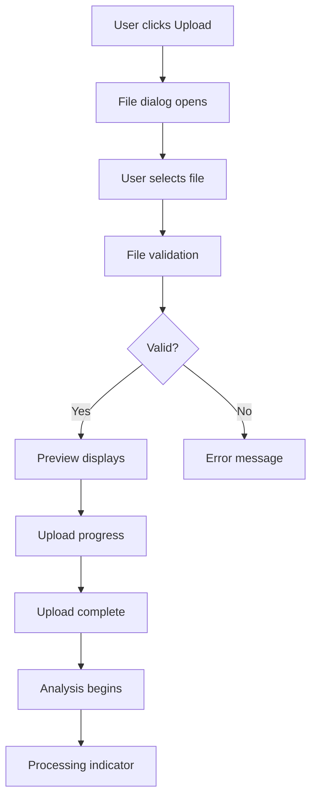
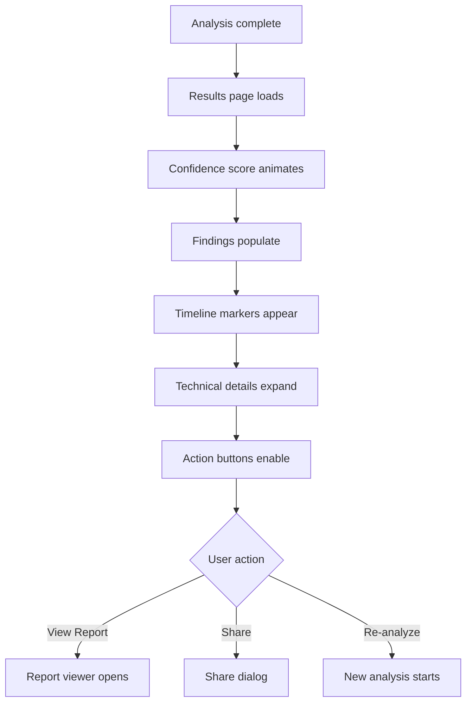
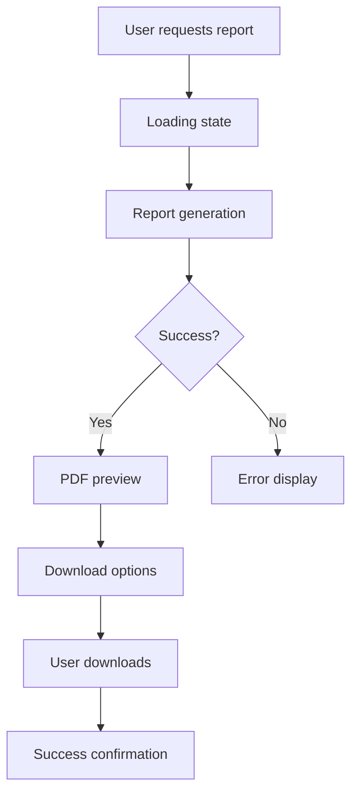

# VeritasAI Animations and Interactions

## 1. Micro-interactions Design

### 1.1 Button Interactions
**Primary Button**
- **Hover**: Subtle scale transformation (1.02x) with color darkening
- **Press**: Slight depression effect with shadow reduction
- **Focus**: Animated ring pulse for keyboard navigation
- **Loading**: Progress spinner replaces text with fade transition

**Icon Button**
- **Hover**: Background fill with 10% opacity of primary color
- **Press**: Scale down to 0.95x with color intensification
- **Active**: Persistent background fill with 20% opacity

### 1.2 Form Interactions
**Input Fields**
- **Focus**: Smooth border color transition to primary color
- **Validation**: Shake animation for errors with color flash
- **Success**: Gentle pulse animation with green border
- **Placeholder**: Fade out animation when typing begins

**File Upload**
- **Drag Over**: Border glow animation with pulsing effect
- **Drop**: Scale-down bounce animation with success indicator
- **Processing**: Progress bar with smooth fill animation

### 1.3 Status Indicators
**Confidence Badge**
- **State Change**: Color transition with slight scale animation
- **Hover**: Information tooltip with fade-in slide-up animation
- **Loading**: Pulse animation for processing states

**Progress Bar**
- **Fill**: Smooth width transition with easing function
- **Completion**: Brief scale animation on reaching 100%
- **Error**: Shake animation with color transition to red

## 2. Page Transition Animations

### 2.1 Navigation Transitions
**Dashboard to Analysis**
- Slide left transition with fade
- Duration: 300ms
- Easing: cubic-bezier(0.4, 0, 0.2, 1)

**Analysis to Results**
- Scale up from center with fade in
- Duration: 400ms
- Delay: 200ms after analysis completion

**Modal Overlay**
- Background fade: 200ms
- Modal slide up: 300ms with bounce effect
- Close reverse: 200ms with acceleration

### 2.2 Content Loading
**Skeleton Screens**
- Wave animation across loading placeholders
- Duration: 1.5s infinite loop
- Easing: ease-in-out

**Data Visualization**
- Chart drawing animation: stroke-dashoffset
- Duration: 800ms with delay between elements
- Easing: ease-out for natural progression

## 3. User Flow Interactions

### 3.1 Content Upload Flow


### 3.2 Analysis Results Flow


### 3.3 Report Generation Flow


## 4. Detailed Animation Specifications

### 4.1 Easing Functions
- **Standard**: cubic-bezier(0.4, 0, 0.2, 1) - For most transitions
- **Accelerated**: cubic-bezier(0.4, 0, 1, 1) - For exits and dismissals
- **Decelerated**: cubic-bezier(0, 0, 0.2, 1) - For entrances and builds
- **Sharp**: cubic-bezier(0.4, 0, 0.6, 1) - For micro-interactions

### 4.2 Duration Guidelines
- **Micro-interactions**: 100-200ms
- **Page transitions**: 300-500ms
- **Loading states**: 800-1200ms
- **Attention getters**: 1500-2000ms

### 4.3 Animation Properties
**CSS Transitions**
```css
.button {
  transition: all 200ms cubic-bezier(0.4, 0, 0.2, 1);
}

.progress-bar {
  transition: width 800ms cubic-bezier(0, 0, 0.2, 1);
}

.modal {
  transition: transform 300ms cubic-bezier(0.4, 0, 0.2, 1),
              opacity 200ms ease-out;
}
```

**Keyframe Animations**
```css
@keyframes pulse {
  0% { transform: scale(1); }
  50% { transform: scale(1.05); }
  100% { transform: scale(1); }
}

@keyframes wave {
  0% { background-position: -200% 0; }
  100% { background-position: 200% 0; }
}

@keyframes shake {
  0%, 100% { transform: translateX(0); }
  25% { transform: translateX(-5px); }
  75% { transform: translateX(5px); }
}
```

## 5. Platform-Specific Animations

### 5.1 Web/Desktop Animations
- **Hover Effects**: Smooth transitions for mouse interactions
- **Scrolling**: Parallax effects for dashboard widgets
- **Drag and Drop**: Real-time feedback during file operations
- **Window Management**: Multi-window transitions for desktop app

### 5.2 Mobile Animations
- **Touch Feedback**: Ripple effects for tap interactions
- **Gesture Navigation**: Swipe transitions between views
- **Pull to Refresh**: Custom spinner with brand elements
- **Keyboard Transitions**: Smooth input field adjustments

### 5.3 Browser Extension Animations
- **Popup Transitions**: Quick slide-in from toolbar
- **Content Overlay**: Seamless integration with web pages
- **Analysis Indicator**: Floating badge with status updates
- **Notification Toasts**: Non-intrusive information displays

## 6. Performance Optimization

### 6.1 Animation Best Practices
- Use `transform` and `opacity` for performant animations
- Leverage GPU acceleration with `will-change` property
- Limit simultaneous animations to prevent jank
- Use `prefers-reduced-motion` media query for accessibility

### 6.2 Animation Throttling
```css
@media (prefers-reduced-motion: reduce) {
  * {
    animation-duration: 0.01ms !important;
    animation-iteration-count: 1 !important;
    transition-duration: 0.01ms !important;
  }
}
```

### 6.3 Lazy Loading Animations
- Defer non-critical animations until after page load
- Use Intersection Observer for scroll-triggered animations
- Implement animation budgets to prevent performance issues

## 7. Accessibility Considerations

### 7.1 Motion Sensitivity
- Provide motion reduction settings in user preferences
- Respect browser-level motion reduction preferences
- Offer alternative static interfaces for motion-sensitive users

### 7.2 Screen Reader Compatibility
- Ensure animations don't interfere with screen reader operation
- Provide equivalent information through ARIA labels
- Use `aria-live` for dynamic content updates

### 7.3 Keyboard Navigation
- Ensure all animated elements are keyboard accessible
- Provide focus indicators for interactive animations
- Maintain logical tab order during animated transitions

## 8. Implementation Examples

### 8.1 React Component with Animations
```jsx
import { motion } from 'framer-motion';

const AnalysisCard = ({ status, confidence }) => {
  const statusVariants = {
    initial: { opacity: 0, y: 20 },
    animate: { opacity: 1, y: 0 },
    exit: { opacity: 0, y: -20 }
  };

  const confidenceVariants = {
    initial: { scale: 0 },
    animate: { scale: 1 },
    whileHover: { scale: 1.05 }
  };

  return (
    <motion.div
      variants={statusVariants}
      initial="initial"
      animate="animate"
      exit="exit"
      transition={{ duration: 0.3 }}
    >
      <motion.div
        variants={confidenceVariants}
        whileHover="whileHover"
        transition={{ type: "spring", stiffness: 300 }}
      >
        <ConfidenceMeter value={confidence} />
      </motion.div>
    </motion.div>
  );
};
```

### 8.2 CSS Animation Implementation
```css
.confidence-meter {
  transition: all 300ms cubic-bezier(0.4, 0, 0.2, 1);
}

.confidence-meter:hover {
  transform: scale(1.02);
}

.confidence-meter.processing {
  animation: pulse 2s infinite;
}

@keyframes pulse {
  0% { box-shadow: 0 0 0 0 rgba(37, 99, 235, 0.4); }
  70% { box-shadow: 0 0 0 10px rgba(37, 99, 235, 0); }
  100% { box-shadow: 0 0 0 0 rgba(37, 99, 235, 0); }
}
```

These animations and interactions enhance the user experience by providing visual feedback, guiding user attention, and creating a polished, professional interface for VeritasAI's deepfake detection platform.