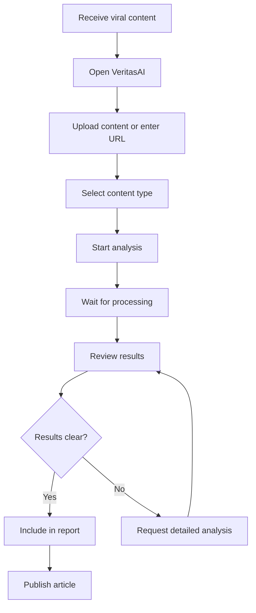
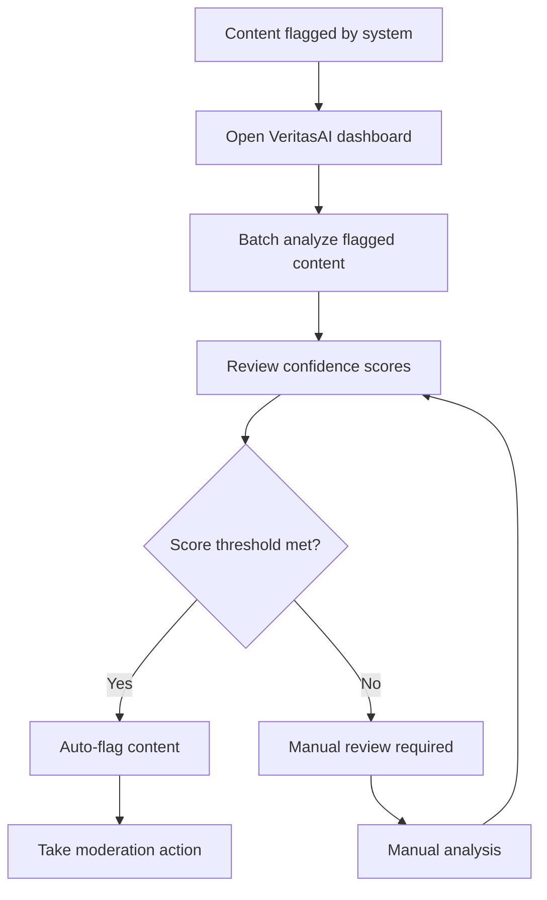
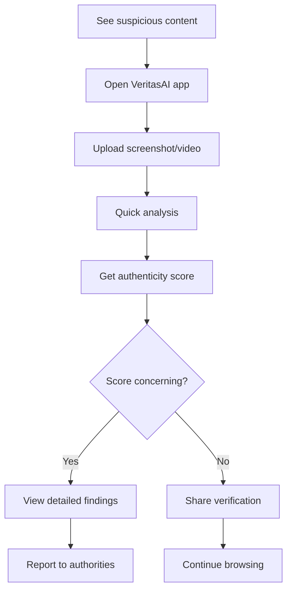

# VeritasAI User Flows and Content Hierarchy

## 1. User Journey Maps

### 1.1 Journalist User Journey

### 1.2 Social Media Moderator Journey

### 1.3 General User Journey

## 2. Core User Flows

### 2.1 Content Analysis Flow
1. **Entry Point**
   - Dashboard quick actions
   - Direct URL navigation
   - Browser extension context menu

2. **Content Selection**
   - File upload from device
   - URL input for online content
   - Clipboard paste for quick analysis

3. **Content Validation**
   - File type checking
   - Size limitations
   - Format compatibility

4. **Analysis Configuration**
   - Auto-detect vs. manual content type
   - Advanced options (sensitivity levels)
   - Priority settings

5. **Processing Queue**
   - Queue position indicator
   - Estimated time calculation
   - Progress updates

6. **Results Presentation**
   - Overall authenticity score
   - Confidence level indicator
   - Detailed findings timeline
   - Technical specifications

### 2.2 Report Generation Flow
1. **Report Initiation**
   - From analysis results page
   - From reports dashboard
   - Scheduled automated reports

2. **Report Customization**
   - Content selection
   - Format options (PDF, HTML, JSON)
   - Detail level settings
   - Branding options (enterprise)

3. **Report Processing**
   - Template application
   - Data compilation
   - Formatting and styling

4. **Report Delivery**
   - Download option
   - Email delivery
   - API export
   - Sharing links

### 2.3 User Management Flow
1. **Registration**
   - Email verification
   - Terms acceptance
   - Initial setup wizard

2. **Authentication**
   - Login with email/password
   - Social login options
   - Two-factor authentication
   - Password reset flow

3. **Profile Management**
   - Personal information updates
   - Notification preferences
   - API key management
   - Subscription settings

## 3. Information Architecture

### 3.1 Content Hierarchy

#### Primary Navigation
1. **Dashboard**
   - Overview statistics
   - Recent analyses
   - Quick actions

2. **New Analysis**
   - Content upload
   - URL analysis
   - Batch processing

3. **Reports**
   - Analysis history
   - Saved reports
   - Export options

4. **Profile**
   - Account settings
   - Subscription management
   - API access

#### Secondary Navigation
1. **Analysis Details**
   - Confidence visualization
   - Findings timeline
   - Technical specifications
   - Action options

2. **Report Viewer**
   - Interactive findings
   - Export controls
   - Sharing options

3. **Settings**
   - Notification preferences
   - Theme selection
   - Accessibility options

### 3.2 Content Grouping

#### Dashboard Content
- **Statistics Cards**
  - Total analyses
  - Deepfakes detected
  - Average confidence
- **Recent Analyses List**
  - Content thumbnails
  - Status indicators
  - Quick actions
- **Quick Actions**
  - Upload file
  - Enter URL
  - Batch process

#### Analysis Results Content
- **Overview Section**
  - Authenticity score
  - Confidence level
  - Processing metadata
- **Findings Section**
  - Detection categories
  - Timeline visualization
  - Detailed descriptions
- **Technical Section**
  - Model versions
  - Processing parameters
  - Performance metrics

#### Report Content
- **Executive Summary**
  - Key findings
  - Risk assessment
  - Recommendations
- **Detailed Analysis**
  - Technical specifications
  - Model performance
  - Confidence breakdown
- **Supporting Data**
  - Raw findings
  - Metadata
  - Processing logs

## 4. Navigation Patterns

### 4.1 Global Navigation
- **Persistent Top Bar**
  - Logo and branding
  - Primary navigation links
  - User profile menu
  - Notifications center

- **Contextual Side Navigation**
  - Dashboard widgets
  - Analysis tools
  - Report management
  - Settings access

### 4.2 Local Navigation
- **Breadcrumbs**
  - Clear path indication
  - Quick navigation to parent pages
  - Context preservation

- **Tabs**
  - Related content grouping
  - Parallel workflow options
  - State persistence

- **Pagination**
  - Large dataset navigation
  - Performance optimization
  - User progress tracking

### 4.3 Mobile Navigation
- **Bottom Navigation Bar**
  - Primary destinations
  - Active state indication
  - Quick access to core features

- **Hamburger Menu**
  - Secondary navigation items
  - User account access
  - Settings and preferences

- **Floating Action Button**
  - Primary action shortcut
  - Context-sensitive options
  - Prominent visibility

## 5. Content Prioritization

### 5.1 Primary Content
- **Authenticity Score**
  - Largest visual element
  - Clear numerical display
  - Color-coded status

- **Confidence Level**
  - Prominent placement
  - Detailed explanation
  - Visual indicator

- **Key Findings**
  - High-level summary
  - Critical issue highlighting
  - Actionable insights

### 5.2 Secondary Content
- **Technical Details**
  - Expandable sections
  - Expert-level information
  - Model specifications

- **Processing Metadata**
  - Timing information
  - Resource utilization
  - System performance

- **Historical Context**
  - Comparison data
  - Trend analysis
  - Performance tracking

### 5.3 Tertiary Content
- **Help and Documentation**
  - Contextual assistance
  - Tooltips and guides
  - FAQ references

- **Sharing Options**
  - Social media integration
  - Direct links
  - Export capabilities

- **Feedback Mechanisms**
  - Reporting tools
  - Improvement suggestions
  - Contact options

## 6. Search and Filter Systems

### 6.1 Global Search
- **Unified Search Bar**
  - Content across all platforms
  - Smart suggestions
  - Quick filters

- **Search Results**
  - Categorized display
  - Relevance ranking
  - Preview snippets

### 6.2 Contextual Filtering
- **Dashboard Filters**
  - Date range selection
  - Status filtering
  - Content type options

- **Report Filters**
  - Confidence thresholds
  - Detection categories
  - Processing dates

- **Analysis Filters**
  - Model versions
  - Processing time
  - User assignments

## 7. Progressive Disclosure

### 7.1 Information Layers
1. **Overview Layer**
   - Key metrics and status
   - Immediate insights
   - Primary actions

2. **Detail Layer**
   - Expanded findings
   - Technical specifications
   - Supporting data

3. **Expert Layer**
   - Model internals
   - Raw data access
   - Advanced configuration

### 7.2 Interaction Patterns
- **Expandable Sections**
  - Click to reveal more
  - Smooth animations
  - State persistence

- **Modal Overlays**
  - Focused interactions
  - Context preservation
  - Easy dismissal

- **Slide-out Panels**
  - Supplementary information
  - Non-disruptive access
  - Space efficiency

This structured approach to user flows and content hierarchy ensures that VeritasAI provides an intuitive, efficient, and accessible experience for all user personas while maintaining the technical depth required for expert users.