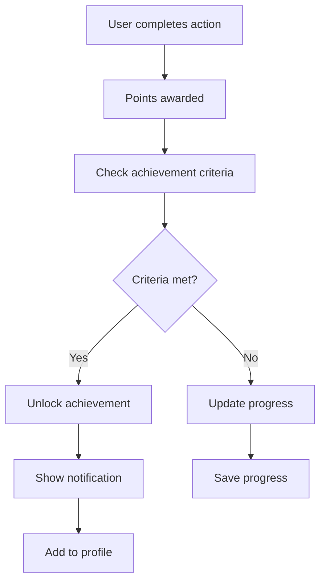
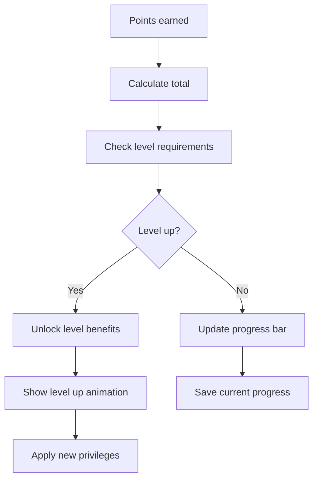
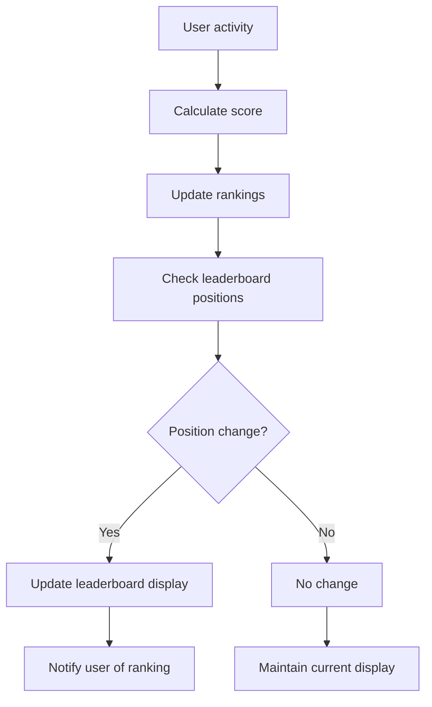

# VeritasAI Gamification System

## 1. Gamification Strategy Overview

The VeritasAI gamification system is designed to increase user engagement, encourage regular platform usage, and reward users for contributing to the fight against digital misinformation. By incorporating game mechanics into the core user experience, we can make the process of verifying content authenticity more enjoyable and rewarding while maintaining the platform's professional and trustworthy nature.

## 2. Core Gamification Elements

### 2.1 Points System
**Verification Points**
- 10 points for each content analysis
- 25 points for deepfake detection
- 50 points for expert-level analysis confirmation
- 100 points for community-verified findings

**Accuracy Bonus**
- 20 points for high-confidence correct identifications
- 50 points for perfect accuracy streaks (7 days)
- 100 points for expert verification contributions

**Engagement Points**
- 5 points for daily logins
- 15 points for sharing results
- 30 points for detailed feedback submission
- 50 points for tutorial completion

### 2.2 Achievement System
**Beginner Achievements**
- **First Analysis**: Complete your first content verification
- **Truth Seeker**: Analyze 10 pieces of content
- **Pattern Recognizer**: Detect 5 deepfakes
- **Quick Learner**: Complete onboarding tutorial

**Intermediate Achievements**
- **Verification Specialist**: 50 analyses with 80%+ accuracy
- **Community Contributor**: Submit 10 feedback reports
- **Speed Demon**: Complete 5 analyses in under 2 minutes
- **Diverse Analyst**: Analyze all content types (image, video, audio)

**Advanced Achievements**
- **Expert Verifier**: 200 analyses with 90%+ accuracy
- **Deepfake Hunter**: Detect 50 deepfakes
- **Knowledge Sharer**: Create 5 educational posts
- **Consistency King**: 30-day analysis streak

**Special Achievements**
- **Early Adopter**: Joined during beta period
- **Bug Hunter**: Reported critical platform issues
- **Community Leader**: Top 10% in monthly leaderboard
- **Truth Champion**: 1000+ points earned

### 2.3 Progression System
**User Levels**
- **Novice** (0-500 points): Basic analysis tools
- **Analyst** (501-2000 points): Advanced filtering options
- **Expert** (2001-5000 points): Priority processing, beta features
- **Master** (5001+ points): API access, custom models, recognition

**Level Benefits**
- **Novice**: Standard processing speed, basic reports
- **Analyst**: 2x processing speed, detailed reports
- **Expert**: 5x processing speed, API access, custom thresholds
- **Master**: Unlimited processing, model training access, featured status

### 2.4 Social Features
**Leaderboards**
- **Weekly Leaderboard**: Top point earners this week
- **Monthly Leaderboard**: Monthly champions
- **All-Time Leaderboard**: Hall of fame
- **Specialty Leaderboards**: Deepfake detection, speed, accuracy

**Community Recognition**
- **Featured Analysts**: Weekly spotlight on top contributors
- **Success Stories**: User-submitted case studies
- **Peer Acknowledgment**: Upvote system for helpful analyses
- **Mentorship Program**: Expert users guide newcomers

## 3. Gamification Implementation

### 3.1 Points Dashboard
```
┌─────────────────────────────────────────────────────────────────┐
│  USER PROGRESS                                                  │
├─────────────────────────────────────────────────────────────────┤
│  Current Level: Analyst              Points: 1,247/2000         │
│  ┌─────────────────────────────────────────────────────────────┐ │
│  │ ████████████████████░░░░░░░░░░░░░░░░░░░░ 62%                │
│  └─────────────────────────────────────────────────────────────┘ │
│                                                                 │
│  Recent Achievements:                                           │
│  🏆 Deepfake Hunter (50 deepfakes detected)                     │
│  🏆 Speed Demon (5 quick analyses)                              │
│  🏆 Community Contributor (10 feedback submissions)             │
│                                                                 │
│  Next Milestone:                                                │
│  Expert Level (2001 points) - 753 points remaining              │
│  Benefits: Priority processing, beta features                   │
└─────────────────────────────────────────────────────────────────┘
```

### 3.2 Achievement Notifications
**Unlock Animation**
- Badge reveal with particle effects
- Points celebration animation
- Achievement description display
- Social sharing option

**Progress Indicators**
- Level progress bars with animations
- Milestone celebration popups
- Streak counters with visual feedback
- Comparative statistics

### 3.3 Reward System
**Virtual Rewards**
- **Badges**: Collectible achievements for profile display
- **Themes**: Special UI themes for reaching milestones
- **Avatars**: Custom profile images and animations
- **Titles**: Special recognition titles in community

**Tangible Rewards**
- **Premium Features**: Early access to new capabilities
- **Processing Priority**: Faster analysis for high-level users
- **Swag**: Branded merchandise for top contributors
- **Recognition**: Featured in newsletters and social media

## 4. Gamification User Flows

### 4.1 Achievement Unlock Flow


### 4.2 Level Progression Flow


### 4.3 Leaderboard Update Flow


## 5. Gamification Components

### 5.1 Points Display
```jsx
<PointsDisplay 
  currentPoints={1247}
  level="Analyst"
  progress={62}
  nextMilestone={{
    points: 2000,
    name: "Expert",
    benefits: ["Priority processing", "Beta features"]
  }}
/>
```

### 5.2 Achievement Showcase
```jsx
<AchievementShowcase 
  achievements={[
    {id: "deepfake-hunter", name: "Deepfake Hunter", icon: "🎯", unlocked: true},
    {id: "speed-demon", name: "Speed Demon", icon: "⚡", unlocked: true},
    {id: "community-contributor", name: "Community Contributor", icon: "👥", unlocked: true}
  ]}
  lockedAchievements={5}
/>
```

### 5.3 Leaderboard Widget
```jsx
<Leaderboard 
  currentUser={{rank: 12, name: "John Doe", points: 1247}}
  topUsers={[
    {rank: 1, name: "Alice Smith", points: 2450},
    {rank: 2, name: "Bob Johnson", points: 2380},
    {rank: 3, name: "Carol Williams", points: 2210}
  ]}
  timeframe="Weekly"
/>
```

## 6. Gamification Metrics and Analytics

### 6.1 User Engagement Metrics
- **Daily Active Users with Points Activity**
- **Average Points Earned Per User Per Day**
- **Achievement Unlock Rate**
- **Level Progression Velocity**

### 6.2 Retention Metrics
- **Weekly/Monthly Retention by Level**
- **Feature Adoption Post-Level Up**
- **Social Feature Engagement**
- **Premium Conversion Rate**

### 6.3 Community Metrics
- **Leaderboard Participation**
- **Peer Recognition Activity**
- **Tutorial Completion Rates**
- **Feedback Submission Quality**

## 7. Gamification Accessibility

### 7.1 Inclusive Design
- **Colorblind-Friendly Achievement Colors**
- **Screen Reader Compatible Point Displays**
- **Keyboard-Navigable Leaderboards**
- **Reduced Motion Options for Animations**

### 7.2 Cognitive Accessibility
- **Clear Progress Indicators**
- **Simple Achievement Criteria**
- **Consistent Reward Patterns**
- **Adjustable Difficulty Settings**

## 8. Enterprise Gamification

### 8.1 Team-Based Competition
- **Department Leaderboards**
- **Collaborative Achievement Goals**
- **Team Performance Bonuses**
- **Manager Analytics Dashboard**

### 8.2 Custom Branding
- **Branded Achievement Badges**
- **Company-Specific Reward System**
- **Integration with Existing HR Platforms**
- **Professional Development Tracking**

This gamification system transforms the serious task of content verification into an engaging experience that rewards users for their contributions to digital truth while maintaining the professional integrity that VeritasAI users expect.